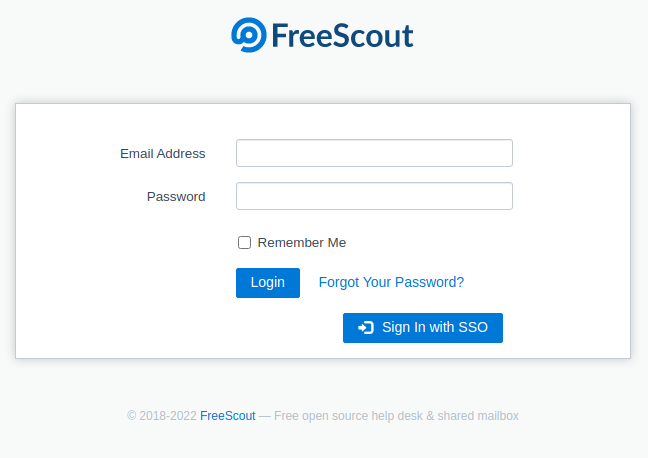
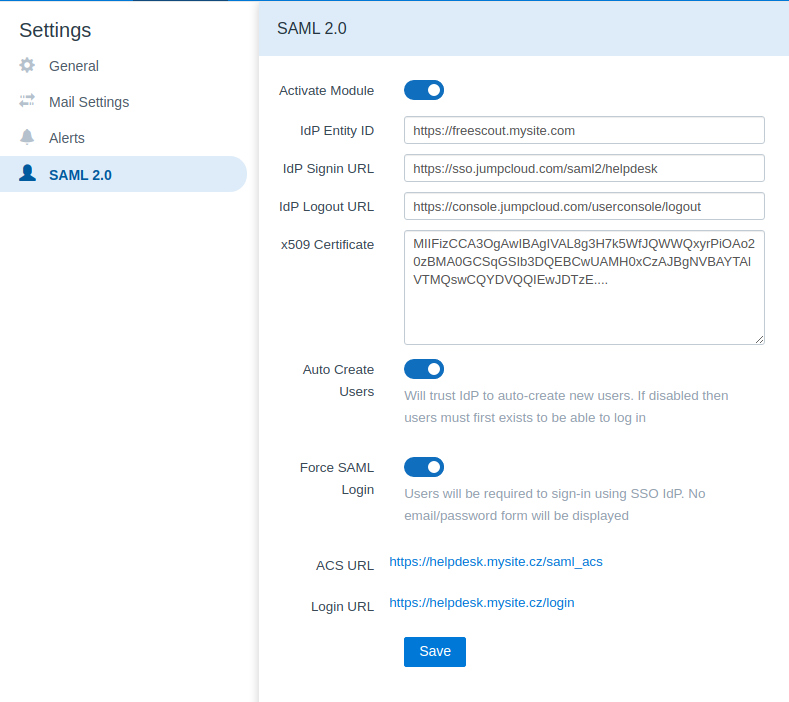

<p align="center">
  
</p>

# SAML 2.0 Module for Freescout

This module is intended to provide SAML 2.0 authentication to [Freescout](https://github.com/freescout-helpdesk/freescout).

Module was tested with [Jumpcloud](https://jumpcloud.com) Identity Provider.

If you need to perform ordinary login with basic form, add `disable_saml` get parameter to login path (`/login?disable_saml=1`). You may also additionally link users to direct SAML login with parameter `saml` such as (`/login?saml=1`)





## Installation

- place module source to Modules folder of your FreeScout installation, module must have **Saml** folder name to work propperly. If you are clonning repo with git, just add folder name in the end of git clone command.
- enable module in modules admin panel
- configure module on settings page (IdP Entity, IdP ACS URL, etc.)
- x509 certificate is needed

## Solving issues

Module uses standard Laravel logging. To see more debug logs add/change following into your `.env` file:

```
APP_DEBUG=true
APP_LOG_LEVEL=debug
```

## Provider Setup

- make sure your provider is configured to return email address as NameID property.
- module will also look for attributes firstname, lastname and jobtitle. New user will be created or updated with these attributes

### Jumpcloud

It's not mentioned in Jumpcloud docs but SLO (Logout URL) is https://sso.jumpcloud.com/saml2/service_name/slo - just append `/slo` to the path of the IDP URL.

| Setting                        | Value                                                              |
| ------------------------------ | ------------------------------------------------------------------ |
| **SAMLSubject NameID**         | email                                                              |
| **SAMLSubject NameID Format**  | urn:oasis:names:tc:SAML:1.1:nameid-format:emailAddress             |
| **Signature Algorithm**        | RSA-SHA256                                                         |
| **Login URL**                  | https://freescout.yoursite.com/login                               |
| **ACS URL**                    | https://freescout.yoursite.com/saml2_acs                           |
| **Attributes mapping**         |                                                                    |
| - firstname                    | JumpCloud Attribute Name: firstname                                |
| - lastname                     | JumpCloud Attribute Name: lastname                                 |
| - jobtitle                     | JumpCloud Attribute Name: jobTitle                                 |
